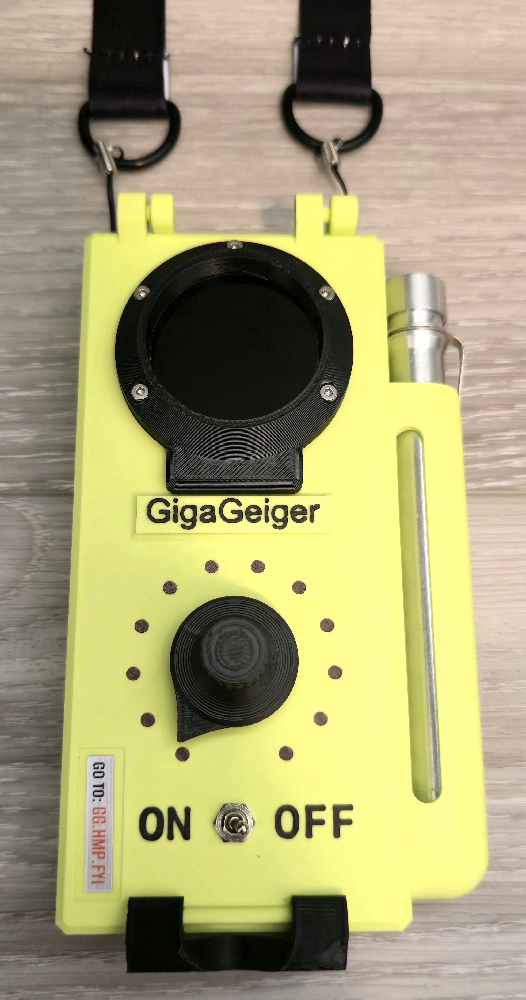

# ☢️ GigaGeiger ☢️

**Wi-Fi Monitoring and Audit Tool** — *with the retro-futurism of a 1950s Geiger Counter.*

STORE: https://www.tindie.com/products/38838/

 

 

## 🧪 What is the GigaGeiger?

**GigaGeiger** is a Wi-Fi reconnaissance and audit device inspired by the nuclear panic aesthetic of the 1950s. Styled like a Geiger counter—but tuned for 2.4GHz radiation—it lets you scan, hunt, and flash with nothing more than a single dial and some Cold War flair.

Designed for field use, hacker cons, and nuclear-style networking fun.

 

## 🔧 Operating Modes

The GigaGeiger features a 3-way rotary power dial. Each position unlocks a different mode:

### ⬅️ All the way LEFT — **Channel Monitor Mode**

- Boots into **Channel Radiation Mode**.
- Spin the dial to select 2.4GHz Wi-Fi channels.
- Watch the packet counts rise like Geiger ticks in Chernobyl.
- Ideal for visualizing channel saturation or scanning for noisy neighbors.

### ⏺️ CENTER — **Foxhunt Mode**

- Boots into **Hot/Cold MAC Tracker**.
- Select a target MAC address.
- Begin your electromagnetic pursuit: RSSI-based tracking lets you zero in on your quarry, warmer/colder style.
- Perfect for CTF-style Wi-Fi foxhunts and device localization.

### ➡️ All the way RIGHT — **Web Flasher Mode**

- Boots into OTA firmware update mode.
- If the device detects an SSID named `GigaGeiger` with the password `Defcon32`, it connects automatically.
- Displays the IP address via screen so you can flash new firmware via web browser.
- Simple, secure, and stylish updates in the field.

 

## 📡 Features

- ESP32-S3 powered
- Rotary dial interface
- Retro UI styled after vintage Geiger meters
- Live packet count visualization per channel
- MAC address-based RSSI tracking
- Web OTA firmware flashing over WPA2
- All modes controlled with a single knob

 

## 🚀 Getting Started

1. Flash the firmware to your GigaGeiger using your favorite method (see below).
2. Power the device on with the knob in your desired position.
3. Start scanning, hunting, or updating!

 

## 🔥 Flashing Firmware

You can flash the GigaGeiger via:

- **TX/RX:**
    -Use labeled TX/RX pads
- **Web Flasher Mode:** 
    - Set up a hotspot named `GigaGeiger` with password `Defcon33`.
    - Turn the knob all the way to the right and power on.
    - The device will show an IP address.
    - Open that IP in a browser and upload new firmware.

 

## 🎛️ Tech Stack

- **MCU:** ESP32-S3-WROOM
- **Language:** Arduino / C++
- **Display:** GC9A01
- **Interface:** Analog rotary dial

 

## 📸 Visuals

Below are some photos of a fully setup GigaGeiger including all wiring, 3D printed caseings, screens, and flair.

### External

 

### Internal

 

### Screens

 

## 🛠️ Contributing

Got ideas for new features, modes, or atomic theming? PRs and issues are welcome! Let’s make Wi-Fi feel radioactive again.

 

## 🧻 License

MIT License. Feel free to use, modify, and share.

 

## ☢️ Inspired By

- 1950s nuclear panic
- DEFCON vibes
- The unmistakable *click-click-click* of a Geiger counter in a sci-fi horror film

 

### 🔍 Find the signal. Follow the radiation. GigaGeiger.

